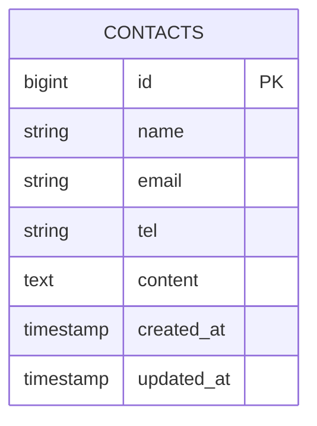

# Contact Form 2（お問い合わせフォーム）

## 概要
このプロジェクトは Laravel を使用して作成した **お問い合わせフォームアプリ**です。  
以下の 3 ステップでお問い合わせを送信できます。

1. 入力ページ  
2. 入力内容確認ページ  
3. 送信完了ページ  

また、**バリデーション（FormRequest）** を使用し、  
入力チェックとエラーメッセージ表示にも対応しています。

---

## Tech Stack
| コンポーネント | バージョン |
|----------------|------------|
| PHP | 8.5.x |
| Laravel | 10.x |
| MySQL | 8.4.x |
| Docker | 最新（Laravel Sail） |

---

## 導入手順（GitHub から clone する場合）

### 1. リポジトリを clone
```bash
git clone git@github.com:osakana-works/contactform2.git
cd contactform2
```

### 2. .env を作成
```bash
cp .env.example .env
```

### 3. .env の DB 設定（Sail 用）
```env
DB_CONNECTION=mysql
DB_HOST=mysql
DB_PORT=3306
DB_DATABASE=laravel
DB_USERNAME=sail
DB_PASSWORD=password
```

### 4. Sail を起動
```bash
./vendor/bin/sail up -d
```

### 5. アプリキー生成
```bash
./vendor/bin/sail artisan key:generate
```

### 6. マイグレーション
```bash
./vendor/bin/sail artisan migrate
```

### 7. ブラウザでアクセス
```
http://localhost
```

---

## 機能一覧

### ✔ 入力ページ（/）
- 名前  
- メールアドレス  
- 電話番号  
- お問い合わせ内容  
- バリデーションエラー表示  
- old() による入力保持  

### ✔ 確認ページ（/contacts/confirm）
- 入力内容の表示  
- hidden による値の引き継ぎ  
- 「送信」ボタンで store() へ POST  

### ✔ 完了ページ（/thanks）
- 送信完了メッセージ表示  

### ✔ データベース保存
- contacts テーブルに保存  
- Eloquent の create() を使用  

---

## ルーティング

```php
Route::get('/', [ContactController::class, 'index']);
Route::post('/contacts/confirm', [ContactController::class, 'confirm']);
Route::post('/contacts', [ContactController::class, 'store']);
```

---

## 使用している主なファイル

### コントローラ
- app/Http/Controllers/ContactController.php

### フォームリクエスト
- app/Http/Requests/ContactRequest.php

### モデル
- app/Models/Contact.php

### ビュー
- resources/views/index.blade.php  
- resources/views/confirm.blade.php  
- resources/views/thanks.blade.php  

---

## マイグレーション（contacts テーブル）

```php
Schema::create('contacts', function (Blueprint $table) {
    $table->id();
    $table->string('name');
    $table->string('email');
    $table->string('tel', 11);
    $table->text('content')->nullable();
    $table->timestamps();
});
```

---

## ER 図



---

## 貢献方法

```bash
git checkout -b feature/機能名
git commit -m "Add: 機能名"
git push origin feature/機能名
```

---

## 参考リンク
- Laravel 公式ドキュメント  
  https://laravel.com/docs
